# GameZone AI

An explainable, agent driven operations layer for an online store. Two LangGraph agents sit behind a storefront and an admin console: one triages every order for fraud, the other moderates every customer review. Each decision is backed by a step by step reasoning trace, so a human admin can see exactly how and why the agent reached its conclusion.


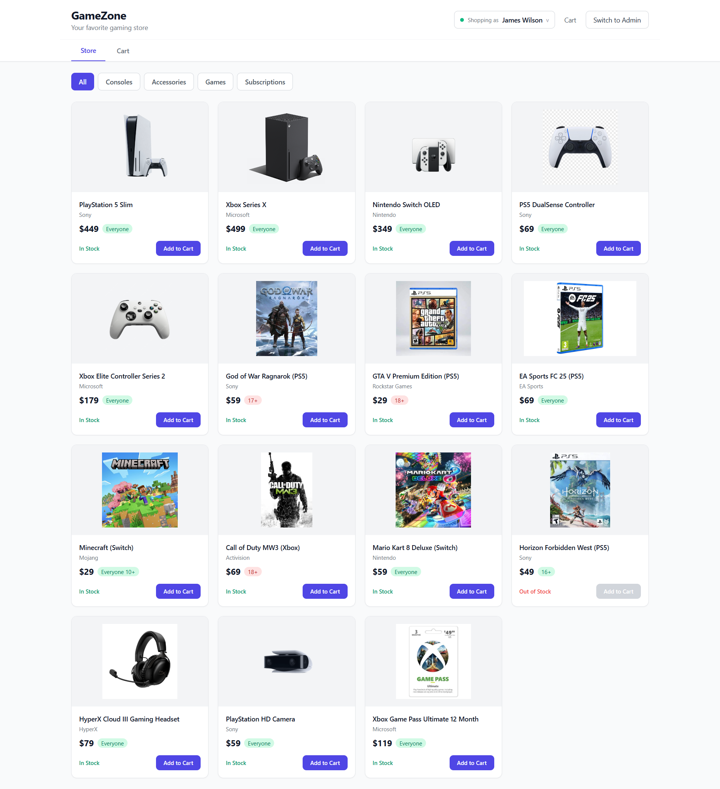

## Overview

GameZone AI is a full stack gaming store with an AI operations layer at its core. Every order placed and every review submitted runs through a bounded reasoning loop that gathers evidence with tools, weighs it against store policy, and produces an auditable verdict for a human admin to confirm.

The system is built around one principle: Python computes the facts, and the language model judges their meaning. Policy thresholds, item counts, and age rating conflicts are calculated deterministically in code. Questions that require judgment, such as whether a cluster of orders looks like a fraud ring or whether a harsh review is abusive or merely critical, are handled by the agent. This split is what keeps the automation both reliable and genuinely useful.

## The Problem

A growing store cannot manually inspect every order and every review, yet the costly cases are exactly the ones that need a second look:

- A reseller places repeated high value console orders under slightly different names shipping to the same address.
- A customer submits a review that is negative but fair, which should be published, next to one that is abusive, which should not.
- Simple rule engines can route by a number, but they cannot read history, spot an alias pattern, or tell respectful criticism apart from harassment.

Human review is accurate but slow and inconsistent at scale. A single model call is fast but blind to history and unreliable at arithmetic. GameZone AI closes that gap.

## What the AI Actually Does

The order agent and the review agent each run as a LangGraph state machine with four stages:

1. **prepare** computes the deterministic policy flags in plain Python and loads recent admin overrides as context.
2. **reason** is the language model, bound to a set of investigation tools. It decides which tool to call next based on what it has learned so far.
3. **act** executes the tool calls, records each result into the reasoning trace, and increments a safety counter.
4. **decide** produces the final structured verdict once the agent has gathered enough evidence.

The loop between **reason** and **act** is what separates this from a wrapper. The agent chooses its own next step, reads real data, and refines its conclusion, capped by a maximum iteration count so it can never run away.

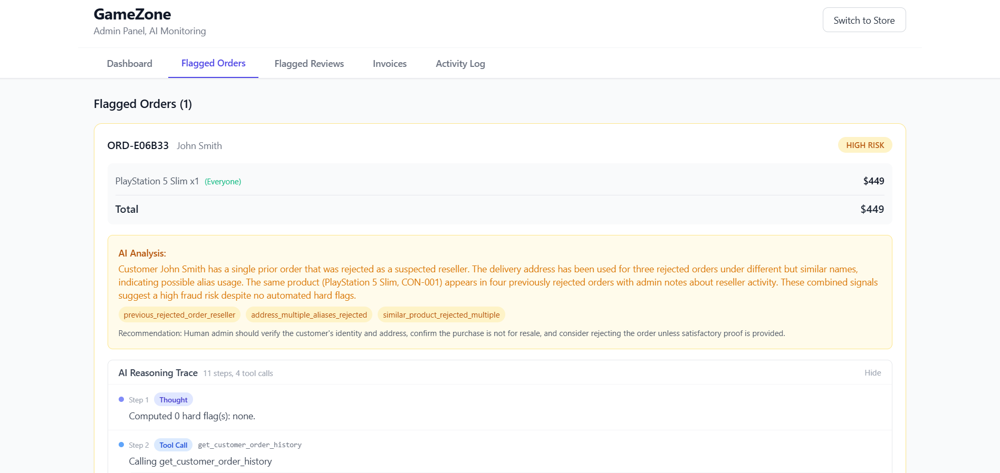

The reasoning trace above is captured for every decision and surfaced in the admin console. It shows each thought, each tool call, each tool result, and the final decision, so the AI is never a black box.

## Tech Stack

| Layer | Technology |
| --- | --- |
| AI orchestration | LangGraph, LangChain |
| Model | Groq (`openai/gpt-oss-120b`) |
| Backend | Python, Flask |
| Database | SQLite via SQLAlchemy |
| Invoices | ReportLab (PDF generation) |
| Frontend | React, Tailwind CSS |

## Automation Principles

The system is designed against the drivers that make automation worth building:

- **High volume and speed.** Every order and review is analyzed on arrival, with no human in the first pass.
- **Error mitigation in high stakes paths.** Spotting an alias ring across dozens of orders is tedious, error prone pattern matching that tools do well and people do poorly.
- **Deterministic and adaptive blend.** Hard policy numbers are rules; fraud intent and review tone are judgment. The two are separated by design, not forced into one prompt.
- **Resource optimization.** The admin reviews only the flagged minority, with the reasoning already laid out, instead of inspecting everything by hand.

## System Architecture

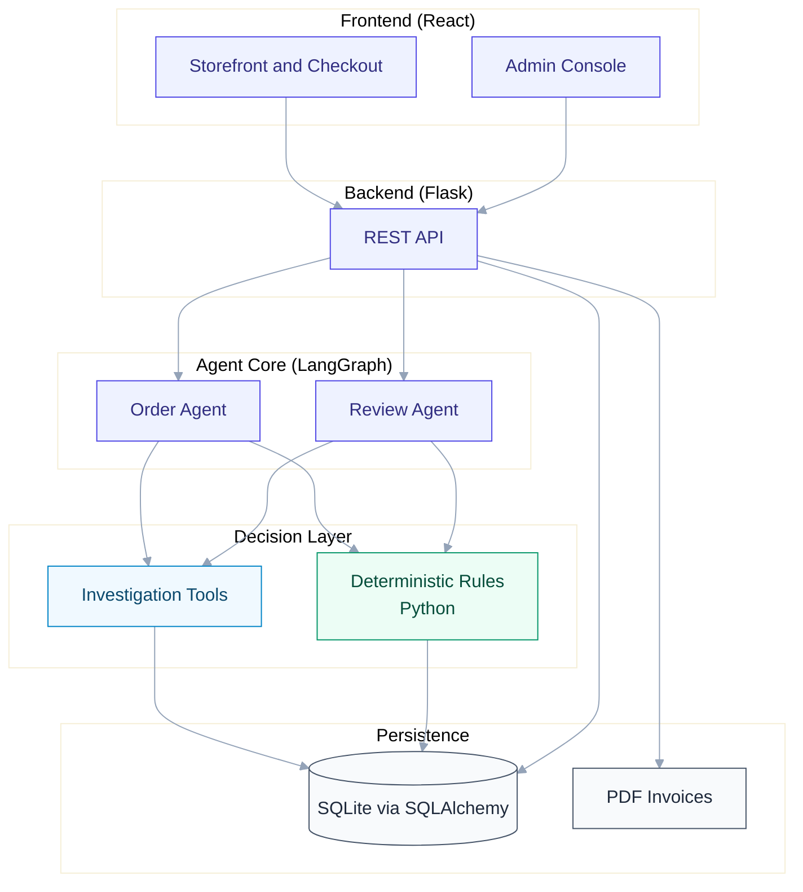

## The Agent Reasoning Loop

Both agents share the same shape. The cycle between reasoning and acting is bounded by a maximum iteration count.

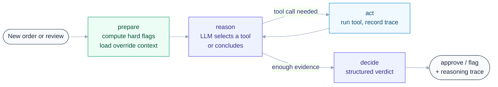

## Order Lifecycle

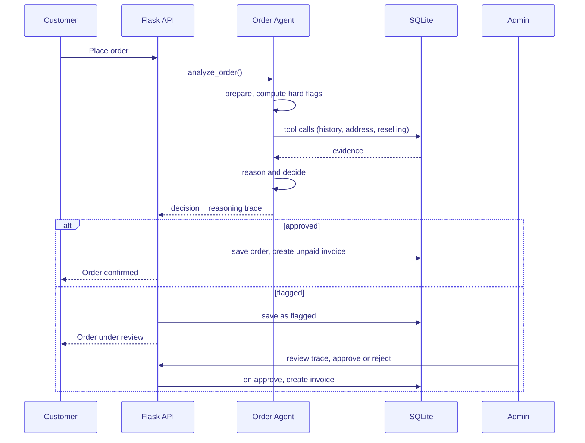

## Deterministic vs LLM Boundary

The rule that keeps the system both accurate and intelligent:

| Owner | Responsibility | Examples |
| --- | --- | --- |
| Python (prepare) | Compute exact, auditable facts | Total vs threshold, item count, same item count, mixed age ratings, console count |
| Tools | Retrieve history and relationships | Same address under other names, consoles bought by this name, verified purchase check |
| LLM (decide) | Weigh facts and findings into a verdict | Fraud ring or false positive, abusive or respectful review, approve or flag with a reason |

## Features

### Customer personas with real history

A persona switcher lets you shop as any of twenty seeded customers, from trusted buyers to a known fraud ring. The agent sees the full history tied to each identity.

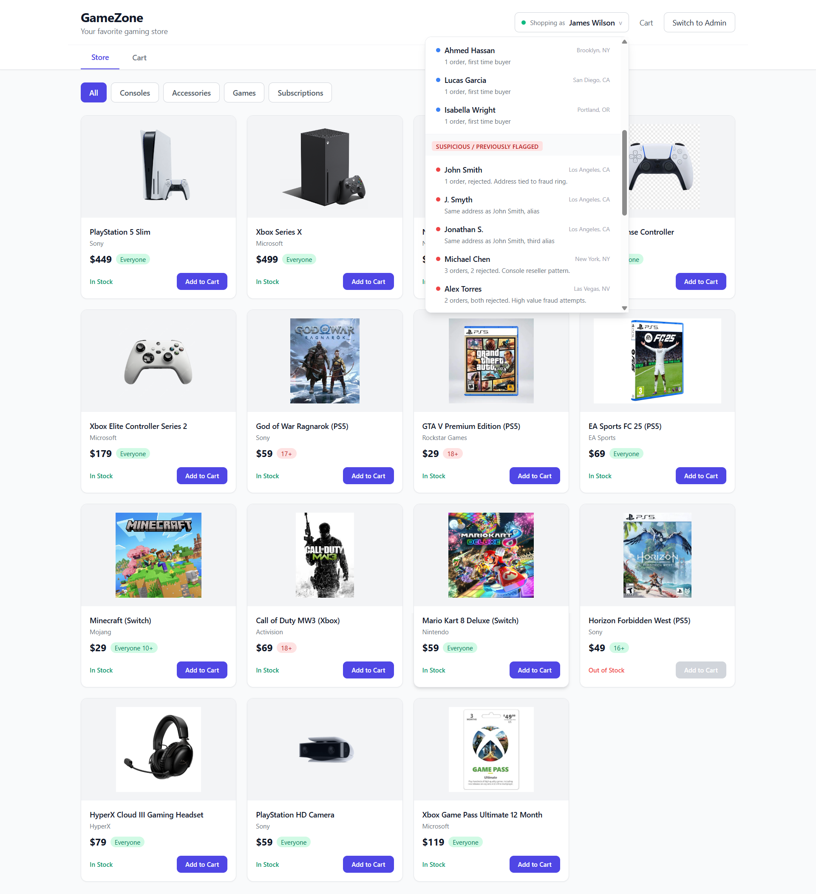

### Fraud triage with explainable flags

A suspicious order is held for review with specific flags and an actionable recommendation, not a vague score.

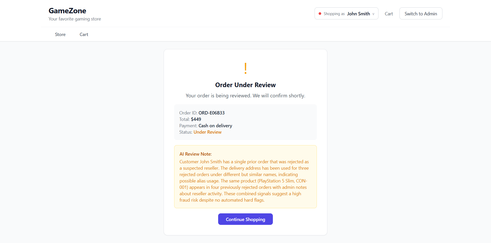

The agent weighs the evidence it gathered into a clear decision:

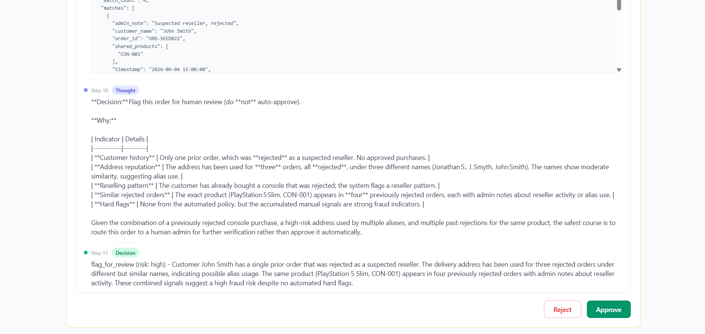

### Review moderation

Abusive content is flagged with a toxicity level and a category, while respectful criticism from a verified buyer is published automatically.

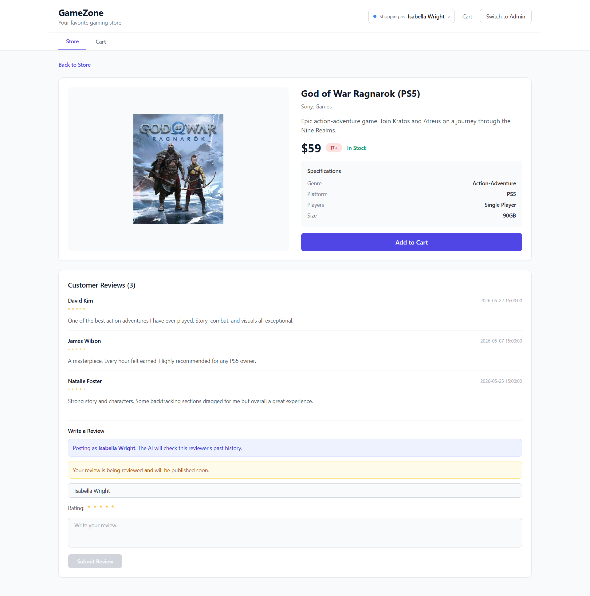
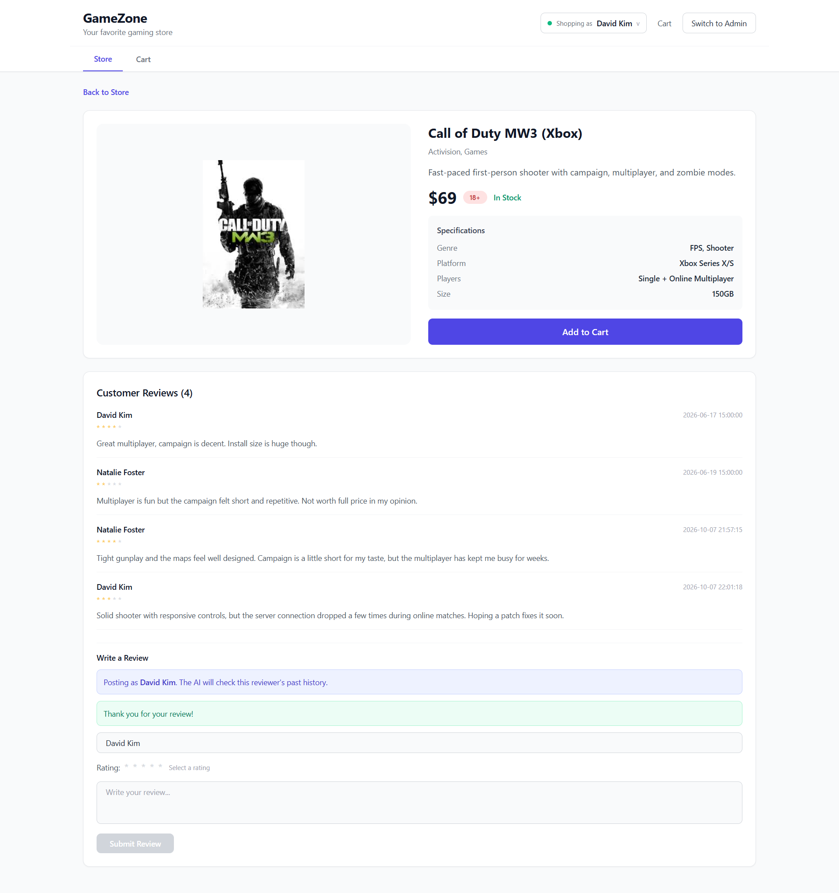

### Invoicing

When an order is approved, an unpaid invoice is generated automatically. The admin can mark it paid and open a formatted PDF.

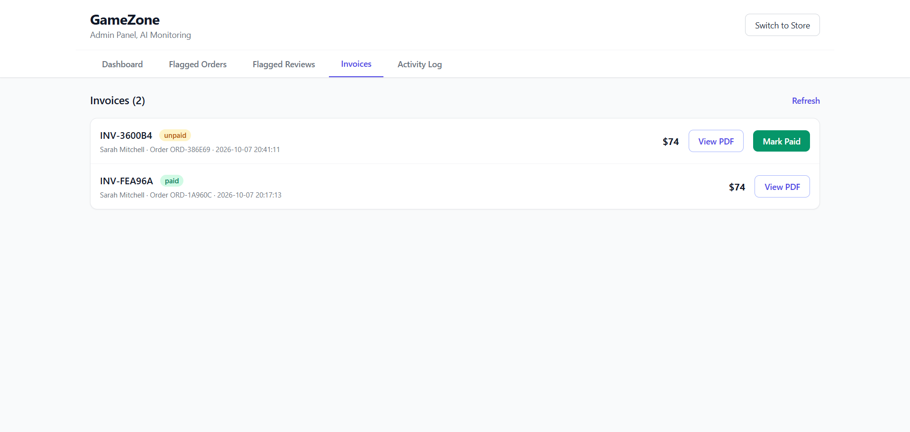
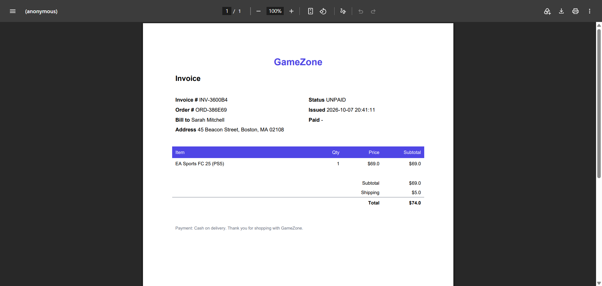

## Evaluation

The project ships with an evaluation harness (`eval.py`) that scores the agents against labeled seed data and reports agreement with the human decision, split into dangerous misses (fraud approved) and annoying misses (a good customer flagged).

On the forty seed orders, the order agent reached about 95 percent agreement with the human decisions, with zero fraudulent orders approved. The full report is written to `eval_report.json`.

## Project Structure

```
gamezone-ai-store/
├── backend/
│   ├── agent_core/
│   │   ├── graph.py          LangGraph order and review agents
│   │   ├── state.py          agent state and reasoning trace
│   │   ├── rules.py          deterministic policy checks
│   │   ├── schemas.py        structured output models
│   │   ├── config.py         model config and health check
│   │   ├── db.py             SQLAlchemy models (SQLite)
│   │   ├── repo.py           data access layer
│   │   ├── invoice.py        PDF invoice generation
│   │   └── tools/
│   │       ├── order_tools.py
│   │       └── review_tools.py
│   ├── data/
│   │   ├── products.json
│   │   └── seed_data.py
│   ├── app.py                Flask API
│   ├── migrate.py            build and seed the database
│   ├── eval.py               agreement evaluation harness
│   └── requirements.txt
├── frontend/
│   └── src/
│       ├── components/        storefront, admin, reasoning trace, invoices
│       ├── data/personas.js
│       └── App.js
└── screenshots/
```

## Getting Started

### Backend

```bash
cd backend
pip install -r requirements.txt
```

Create a `.env` file in `backend/` with your Groq key:

```
GROQ_API_KEY=your_key_here
```

Build and seed the database, then run the API:

```bash
python migrate.py
python app.py
```

The API starts on `http://localhost:5000` and prints a model health check on boot.

### Frontend

```bash
cd frontend
npm install
npm start
```

The app opens on `http://localhost:3000`.

### Notes

- The default model is `openai/gpt-oss-120b` on Groq and can be overridden with a `GROQ_MODEL` environment variable.
- `migrate.py` rebuilds the database from the seed data at any time.
- The generated database and invoice PDFs are not committed; they are reproduced by `migrate.py`.

## How It Reads

If analysis fails for any reason, the request returns an explicit error instead of silently approving or hiding the failure. The AI is either visibly working or visibly not, by design.
